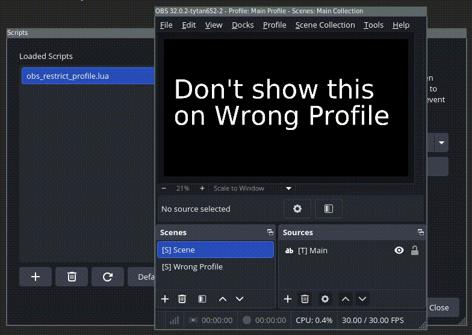

# OBS Restrict Profile

This script forcefully keeps a specific scene active when the configured profile is selected.

This helps prevent going live on a streaming service when in the wrong scene collection.

